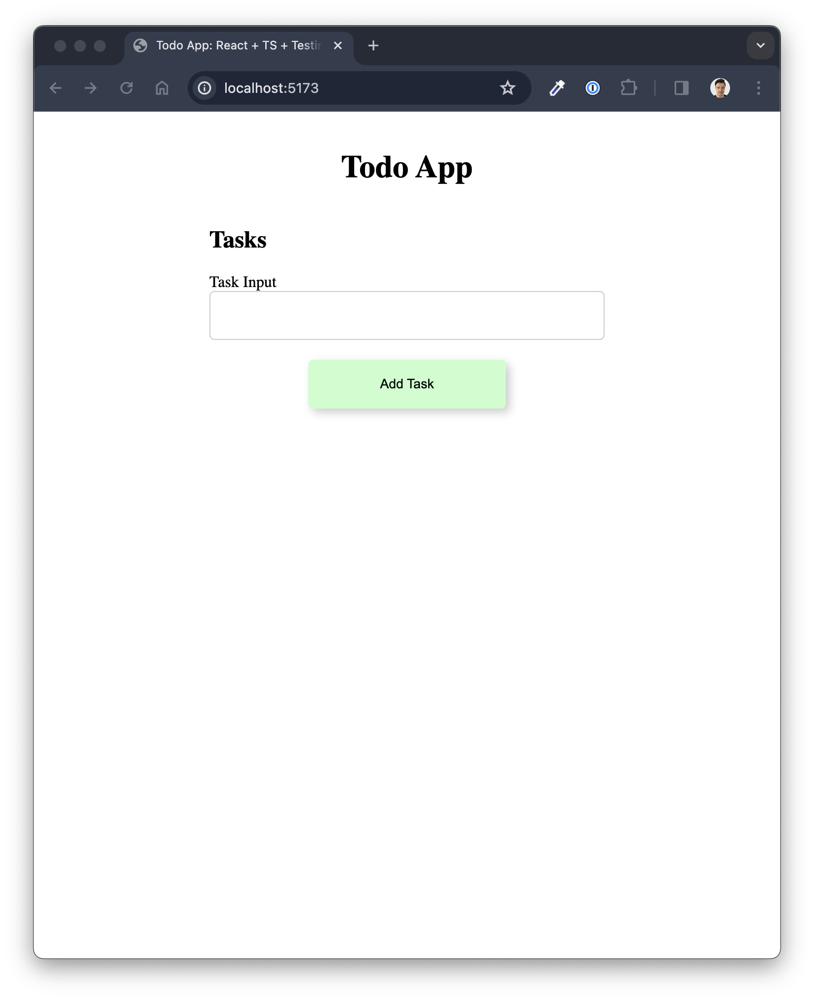
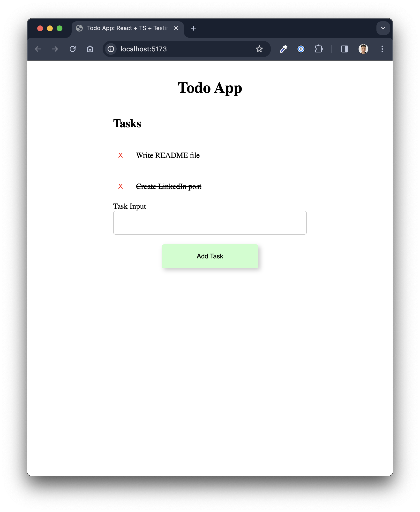

# Todo App

The standard Todo App. Completed with TypeScript, React & Tested with React Testing Library

## Screenshots

The initial load up screen

The app once two tasks have been created and one has been marked as complete.

